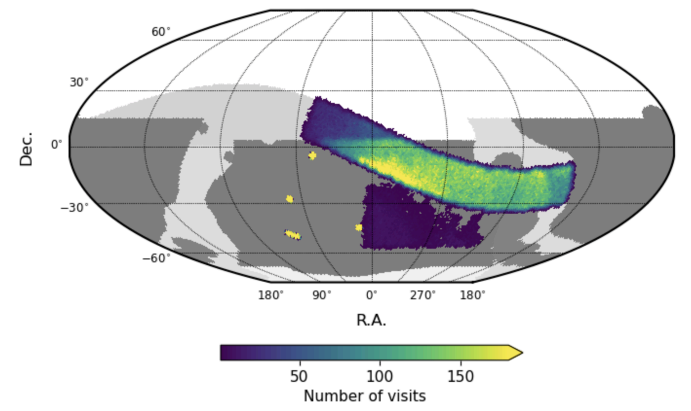

.. _observations:

############
Observations
############

.. important::

   **Placeholder.** This website is currently under development.

Rubin Observatory is still in the commissioning phase.
The key objective is to verify the as-built system and to evaluate the operational efficiency.
The amount of science-grade data collected during commissioning is dependent on several potentially compounding factors, such as resolving emergent technical challenges, calibrating the system performance, weather in Chilean winter, and so on.

Science Validation (SV) surveys
===============================

The baseline Science Validation survey design is described in Section 6 of the
"Construction Completeness and Operations Readiness Criteria" document,
`SITCOMTN-005 <https://sitcomtn-005.lsst.io/>`_.

As of Jun 2025, the SV surveys were expected to begin in late Jun 2025.
It is anticipated that 55% of the night would be available for observations
(after accounting for, e.g., engineering time, weather).
SV survey visits will consist of 30-second exposures in *grizy*-bands and 38-second exposures in *u*-band.
The SV survey design incorporates two components: Deep and Wide.

Deep survey:

* targets four Deep Drilling Fields
* ELAIS S1, XMM LSS, ECDFS, and EDFSa + EDFSb
* rapid temporal sampling
* reaching LSST 10-year depths

Wide survey:

* spans ~160 deg in RA a within 10 degrees of the Ecliptic
* covers extragalactic and Galactic regions
* for template generation in support of Prompt Processing

Any "extra" time is planned to be spent broadening the area of sky
covered by templates for difference imaging.

    Figure 1: This is Figure 4 from SITCOMTN-005, showing the planned science validation surveys coverage expressed as total number of overlapping visits across the ugrizy bands.

Survey strategy
===============

Information about the strategy and cadence for the Legacy Survey of Space and Time can be found at `survey-strategy.lsst.io <https://survey-strategy.lsst.io/>`_.

Nightly projection
------------------

*Placeholder for a future link to a live projection of the LSST scheduler.*

Alert stream status
===================

*Placeholder for a future link to a live dashboard of alert stream status.*
