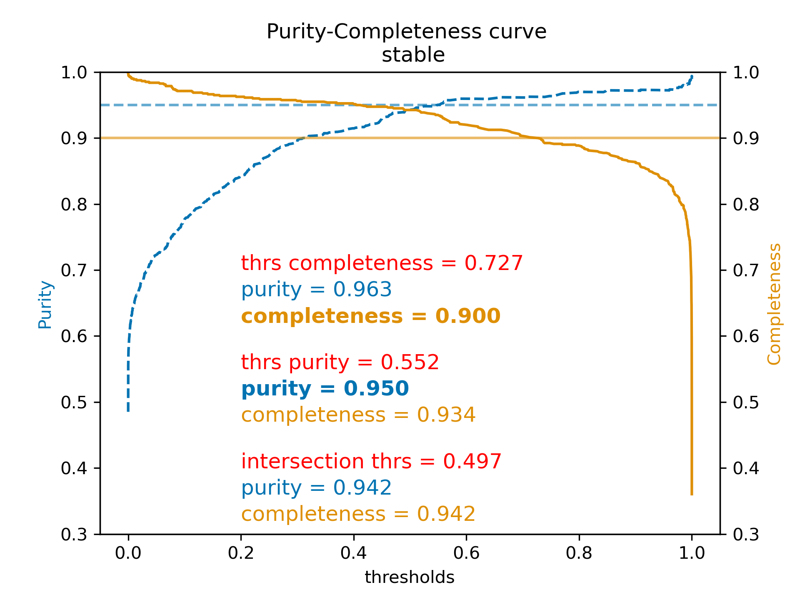

.. _filtering:

#################################
Filtering and Reliability Scoring
#################################

To reduce the proportion of spurious alerts sent to users, several layers of filtering are applied.
These will continue to be tuned over time as more on-sky data is obtained.

Filtering
=========

Artifacts are filtered at several stages.

The difference image detection stage rejects sources with pixels off image; edge; interpolated bad, edge, no data, saturated, and saturated template center pixels; as well as those occurring in modeled diffraction spikes.

Later stages filter sources with cosmic rays in their center pixels as well as those with high template variance and those with negative direct image fluxes indicative of background subtraction problems.

Artificial Satellites
=====================

The aim is to remove artifical satellites from the alert stream.
The predicted positions of known satellites are used to filter ``DiaSources`` prior to alerts.
Trailed sources with motions faster than 10 deg/day are also filtered.

"Glint trails" due to rotating space junks are identified by linear fits to the detected ``DiaSources``.
Glints are not filtered, but are flagged with a ``glint_trail`` boolean.

Reliability
===========

A Convolutional Neural Network (CNN) was trained with a mixture of simulated data and human-labeled transients, variables, and moving objects.
It uses cutout science, template, and difference images to estimate whether a ``DiaSource`` is likely astrophysical.
The resulting ``reliability`` score ranges from 0-1, with larger scores corresponding to more likely real objects.
To minimize the number of false positives, ``DiaSources`` with reliability scores less than 0.1 are filtered out.
Users may select alerts with higher reliability scores to maximize purity.

.. important::

   The performance information below is for the reliability model generated on 2026-02-13.  Continued training and refinement is underway.

The current (2026-02-13) reliability model was retrained using detections collected between August and October of 2025.
The detections are from both the AP and DRP pipeline products.
The detections had a spatial crossmatch with either the Gaia variables catalog (`Rimoldini et al. 2023 <https://doi.org/10.1051/0004-6361/202245591>`_), the TNS catalog, Solar System objects detected by Rubin, and sources from the Rubin source catalog with an extendedness of 1.
Additionally, some detections where the DP1 reliability model assigned a score between 0.5 and 0.9 were also used.
The detections were labeled as Real or Bogus by volunteers through `Rubin Difference Detectives <https://www.zooniverse.org/projects/ebellm/rubin-difference-detectives>`_, a citizen science project on the Zooniverse platform.

A series of analyses was performed on all the classifications provided by the volunteers. An approach similar to the one described in `Marshall et al. (2016) <https://ui.adsabs.harvard.edu/abs/2016MNRAS.455.1171M/abstract>`_ was implemented here; the main idea was to understand how the volunteers performed in the classification task by comparing the label provided by experts and the one provided by volunteers for the same detection.

The initial classification used only detections with high-confidence labels assigned by volunteers.
In total, 13,178 sources were used to fine-tune the DP1 model: 6,630 real and 6,548 bogus. 1,647 were used to validate, and another 1,647 to test the model.
Given the small size of the training data set, in addition to the original images, two augmentations (vertical and horizontal flipping) were added to the training.

For the test data set, at a threshold of 0.552, the purity (precision) is 95.0%, and completeness (recall) is 93.4%.
Users can choose their own reliability threshold to trade off completeness vs. purity.

    Figure 1: Purity (precision) vs. completeness (recall) as a function of reliability threshold value for the 2026-02-13 model.

