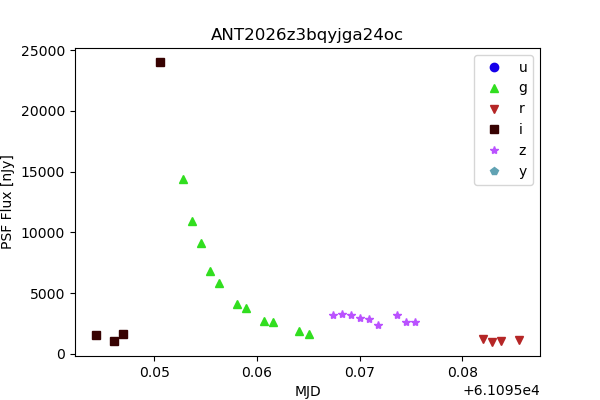

.. _alert_access:

#######################################
Accessing alerts via the Antares client
#######################################

The alerts and additional properties about an object can be accessed via the various brokers' API clients.
This brief tutorial shows how to access alerts using the `Antares <https://antares.noirlab.edu/>`_ client and `Devkit <https://nsf-noirlab.gitlab.io/csdc/antares/devkit/>`_.
Other alert brokers have their own clients; consult their websites for documentation.

All of the following can be executed within a notebook in the RSP, or from a python prompt (or notebook) on your local computer.

Installing the client and devkit
================================

Use ``pip`` to install the client and devkit by running the following on the command line (or, in a notebook cell, prepend a "!" for command-line access):

.. code-block:: text

    pip install --user antares_client
    pip install --user antares_devkit

Retrieve an alert locus
=======================

Antares groups alerts and additional properties at a given position on the sky (i.e., associated with a particular astrophysical object) into an object called a "locus."
Each locus is given a unique ID in Antares.
The following snippet will retrieve the locus for a known Antares ID.
The locus is returned as a Python dict; the last line of this snippet prints the available dict keys.
The lightcurve example below illustrates accessing the "alerts" entries in the dict; other items can be extracted in a similar way.

.. code-block:: Python

    from antares_client import search
    from antares_devkit.models import DevKitLocus

    my_locus_id = "ANT2026z3bqyjga24oc"

    locus_dict = search.get_by_id(my_locus_id).to_devkit(include_catalogs=True)

    locus_dict.keys()

Plot a lightcurve from diaSource measurements
=============================================

The following snippet extracts the flux measurements from the ``diaSource`` properties associated with each alert, then plots a lightcurve.
Note that in the properties, negative fluxes are reported as positive values, but flagged with an "isNegative" flag.
When plotting lightcurves, one should multiply fluxes with the "isNegative" flag by -1.

.. code-block:: Python

    import matplotlib.pyplot as plt
    import numpy as np

    filter_colors = {'u': '#1600EA', 'g': '#31DE1F', 'r': '#B52626',
                     'i': '#370201', 'z': '#BA52FF', 'y': '#61A2B3'}
    filter_names = list(filter_colors.keys())
    filter_symbols = {'u': 'o', 'g': '^', 'r': 'v',
                      'i': 's', 'z': '*', 'y': 'p'}

    temp_mjd = []
    temp_band = []
    temp_flux = []
    for alert in locus_dict['alerts']:
        alert_id = str(alert['id'])
        if alert_id[0:4] == 'lsst':
            temp_mjd.append(alert['mjd'])
            temp_band.append(alert['properties']['lsst_diaSource_band'])
            if alert['properties']['lsst_diaSource_isNegative']:
                temp_flux.append(-1.0 * alert['properties']['lsst_diaSource_psfFlux'])
            else:
                temp_flux.append(alert['properties']['lsst_diaSource_psfFlux'])

    mjd = np.asarray(temp_mjd, dtype='float')
    band = np.asarray(temp_band, dtype='str')
    flux = np.asarray(temp_flux, dtype='float')

    fig = plt.figure(figsize=(6, 4))
    for f, filt in enumerate(filter_names):
        fx = np.where(band == filt)[0]
        plt.plot(mjd[fx], flux[fx], filter_symbols[filt], color=filter_colors[filt], label=filt)
    plt.xlabel('MJD')
    plt.ylabel('PSF Flux [nJy]')
    plt.legend(loc='upper right')
    plt.title(my_locus_id)
    plt.show()

The figure that is produced should look like the following:

    Figure 1: Lightcurve showing the flux measured on difference images as a function of time (in MJD) for a single Antares locus.

