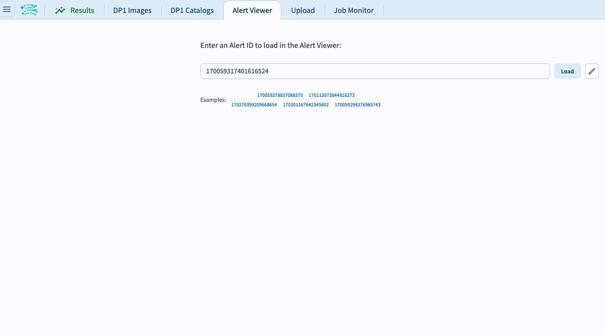
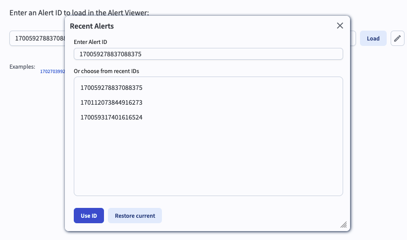
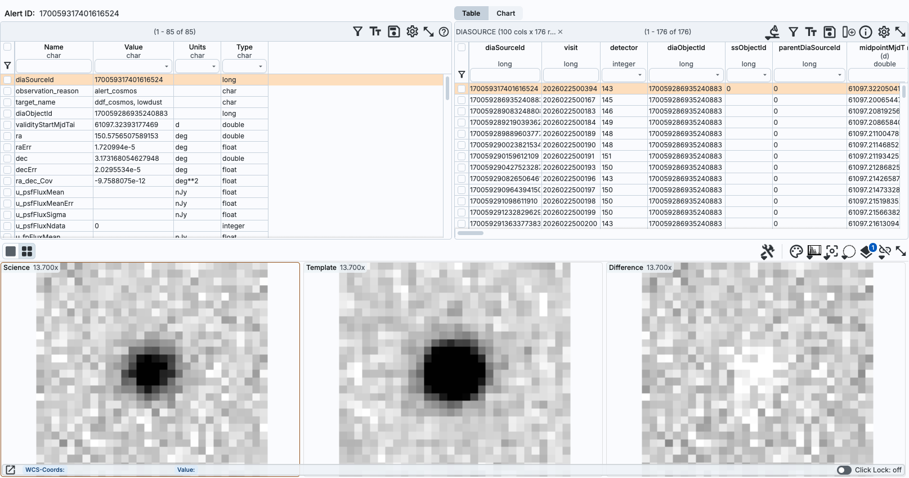

.. _portal-101-1:

#######################################
101.1. Navigate the alerts archive interface
#######################################

For the Portal Aspect of the Rubin Science Platform (RSP) at data.lsst.cloud.

**Data Release:** 

**Last verified to run:** 

**Learning objective:** Navigate the main components of the Portal's alerts archive interface.

**LSST data products:** 

**Credit:** Originally developed by the Rubin Community Science team.
Please consider acknowledging them if this tutorial is used for the preparation of journal articles, software releases, or other tutorials.

**Get Support:** Everyone is encouraged to ask questions or raise issues in the `Support Category <https://community.lsst.org/c/support/6>`_ of the Rubin Community Forum.
Rubin staff will respond to all questions posted there.

----

**1. Go to the RSP.**
In a web browser go to the RSP using the URL `data.lsst.cloud <https://data.lsst.cloud/>`_.

**2. Log in.**
On the RSP landing page (Figure 1), if "Log in" appears at upper right instead of your username, click "Log in" and follow the prompts to authenticate.

** 3. Click on the Alert Viewer tab. Enter alert id 170059317401616524 and hit "load". The pencil button next to load allows you to view recent alert ids. 

    Figure 1: 

    Figure 2: 

** 4. Review the results for alert id 170059317401616524. The results interface default view includes the alert summary, results from the diaSource table, and image stamps. 

    Figure 3: 

** 5. Click on "chart" to view the light curve.

.. figure:: images/portal-101-1-3.png
    :name: portal-101-1-3
    :alt: 

    Figure 4: 

** 6.

